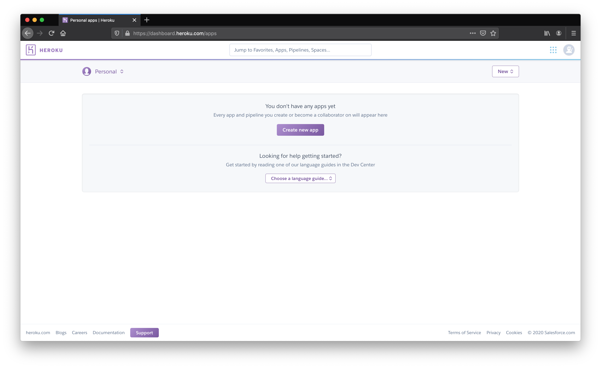
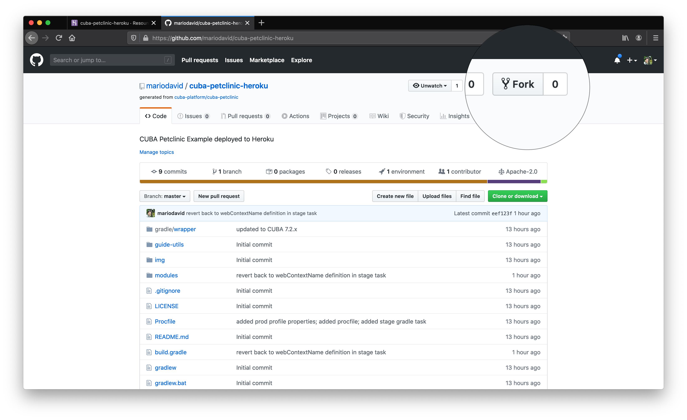
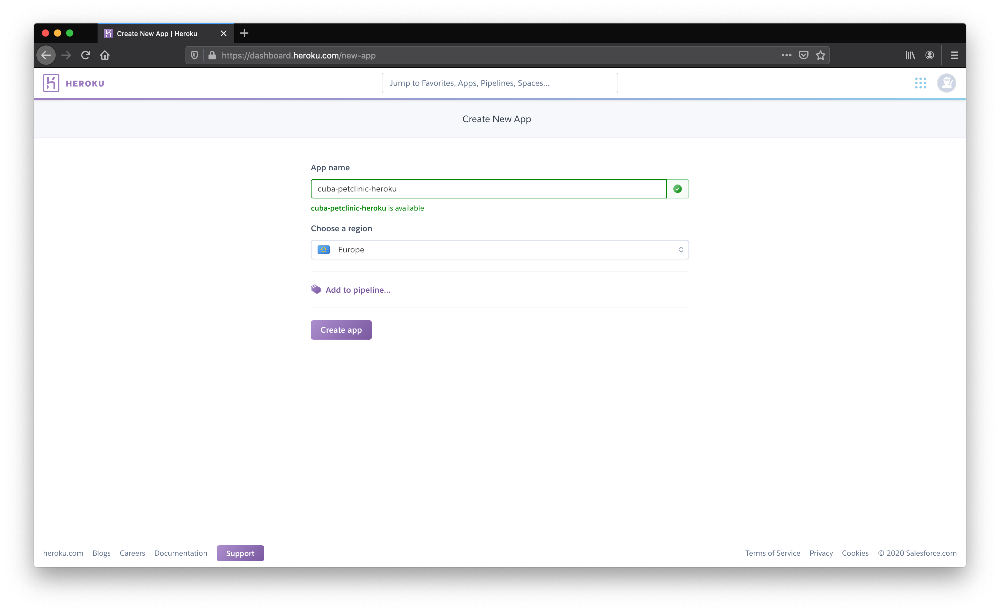
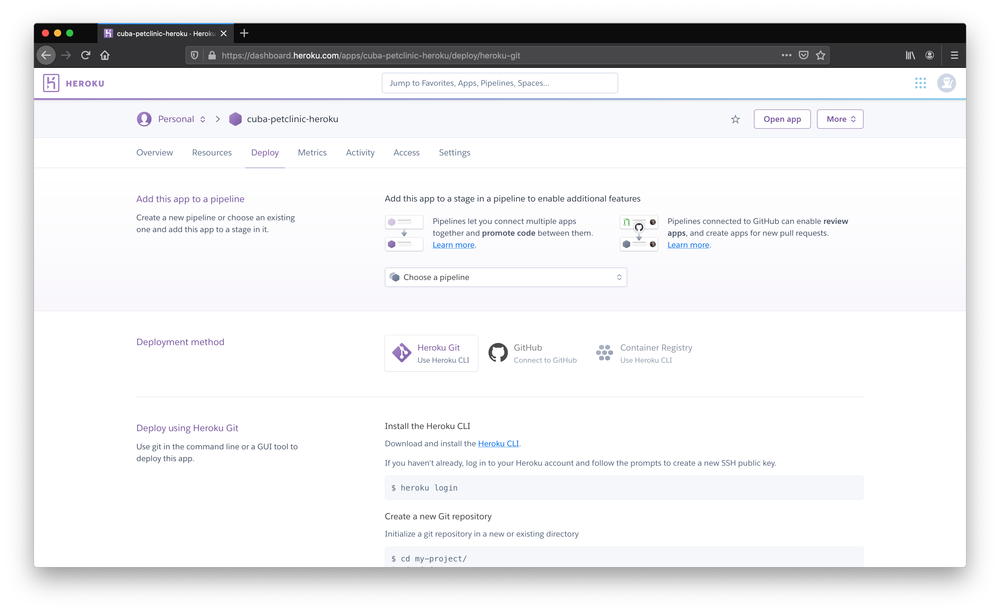
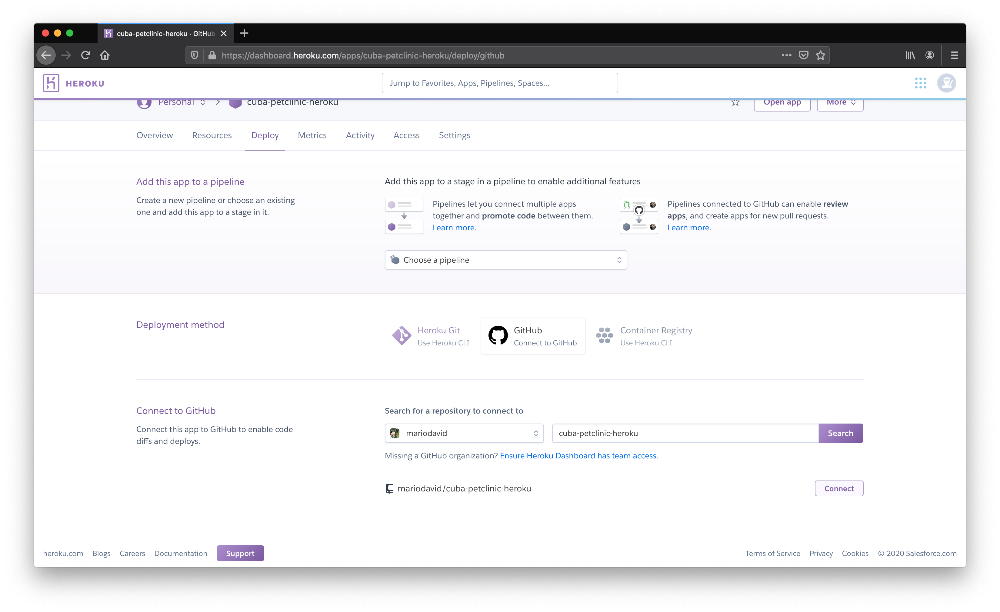
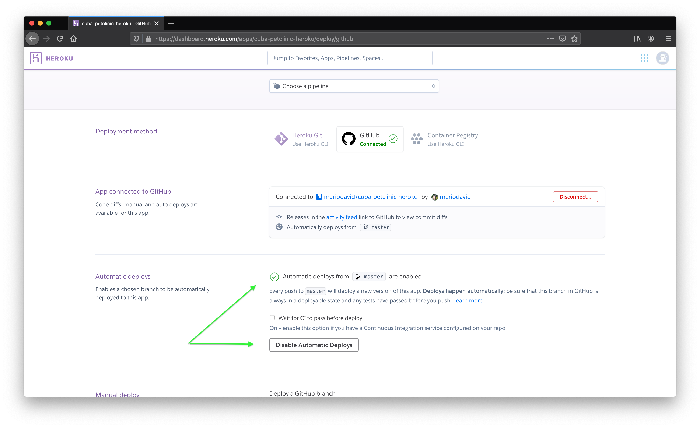
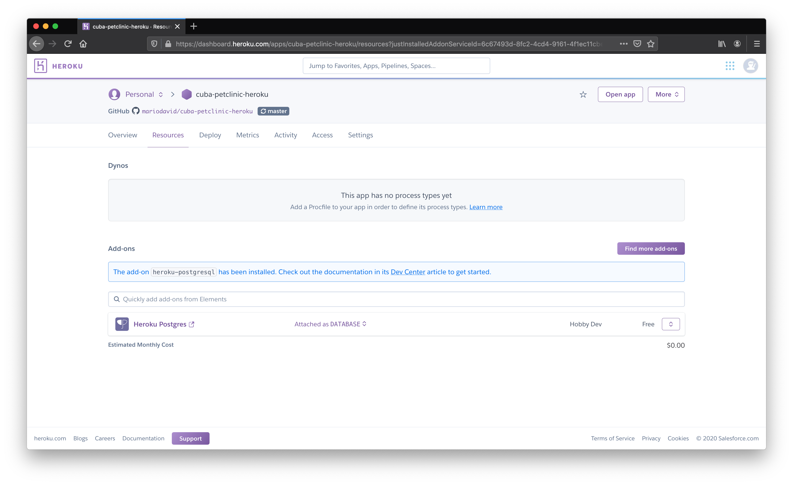

# CUBA Petclinic - Heroku

<p align="center">
  
</p>


CUBA Petclinic is a CUBA platform example application dealing with the domain of a petclinic. It is based on the commonly known [Spring Petclinic](https://github.com/spring-projects/spring-petclinic) example.

The CUBA Petclinic application deals with the domain of a Pet clinic and the associated business workflows to manage a pet clinic.

## Heroku Deployment

This example shows how to easily deploy the Petclinic application to Heroku. Heroku is a PaaS offering, that allows to
have a very easy and frictionless experience when it comes to running applications in production. Compared to other
cloud providers and solutions, Heroku is very high level in its building blocks. This means that the application developer
that just wants to "host a CUBA application" somewhere, can achieve that goal with very little "heavy lifting" on the 
operations side.

In this example I will guide you through the Steps that are necessary to deploy the Petclinic project to Heroku.

### Step 0: Heroku and Github Account

The first step is that you have both a Heroku and a Github Account. Luckily both of them are free, so there is no problem here.
Also running the application on Heroku for demo purposes is free, which gives you the ability to play around with it.

The reason I chose Github is, that the source code integration from Github to Heroku is as seamless as it can be. 

In that respect all three choices: `CUBA`, `Github` and `Heroku` allow you as the application developer to focus on the most 
important thing: 

> Focus on your business application

After creating the accounts in both services, you will see the Heroku dashboard, where it is possible to create an "app":



### Step 1: Create Github repository and push application

The first step is to put your CUBA application source code into Github source control. If you want to have a quick start
you can use the fork button on this repository, which will create a copy of this example app under you own name that
you can use for the tutorial. 



### Step 2: Create App in Heroku

The next step is to create the app in Heroku. It needs a unique name and a region where it should run.



### Step 3: Connect App to Github

In order to run the Petclinic app, Heroku needs to know where to get the application source code from. This we achieve
by connecting the Heroku app to a particular Github repository.





### Step 4: Automatic Deployments

After the App is connected to the Github Repository, it is now possible to configure an automatic deploy, once
a push to the Github repository is performed by the developer.



We also activate the option to let Heroku wait for the CI server to finish. Only for a successful CI build, the deployment
is performed.

### Step 5: Create Postgres DB

In order to run a CUBA app, it needs a Database. Heroku has tight integration for Postgres databases. What you need to do
is to create an add-on in the "Resources" Tab. Just search for "Postgres" and select the "Hobby" plan, which is free as well.


  

### Step 6: Configure the CUBA application

Now everything is setup on the Heroku and Github side. What needs to be done is some small adjustments on the source code
of the CUBA app itself, in order to run nicely in the Heroku environment. 

CUBA 7.2 in particular introduced some nice enhancements in the configuration option, that makes the integration even easier. 
In particular we will use a production Spring profile, to configure the Database connection. 
Also we will use the ability to let CUBA read in the database credentials from an environment variable, which Heroku automatically
creates for us. 

#### Step 6.1: Help Heroku to Build the CUBA app

Heroku will build our CUBA application on our behalf. Heroku knows about the fact that the app is a gradle application since
the CUBA app has a gradle wrapper configured within the application code.

What it will do is that every time a push to the `master` branch of the Github repository is executed, Heroku loads
the application sources and executes the gradle task `stage`.

For that action to succeed, define the gradle task at the bottom of your `build.gradle`:

```groovy
task stage(dependsOn: ['setupTomcat', ":${modulePrefix}-core:deploy", ":${modulePrefix}-web:deploy"]) {
    doLast {
        // change port from 8080 to heroku $PORT
        def file = new File('deploy/tomcat/conf/server.xml')
        file.text = file.text.replace('8080', '${port.http}')

        // rename deploy/tomcat/webapps/app to deploy/tomcat/webapps/ROOT
        def rootFolder = new File('deploy/tomcat/webapps/ROOT')
        if (rootFolder.exists()) {
            rootFolder.deleteDir()
        }

        def webAppDir = new File("deploy/tomcat/webapps/${modulePrefix}")
        webAppDir.renameTo(new File(rootFolder.path))

        // add local.app.properties for web application
        def webConfDir = new File('deploy/tomcat/conf/ROOT/')
        webConfDir.mkdirs()
        def webProperties = new File(webConfDir, 'local.app.properties')
        webProperties.text = ''' cuba.webContextName = / '''
    }
}
```

This task does the setup of the tomcat, builds the app and performs two additional actions that are written there as
groovy snippets.

#### Step 6.2: Tell CUBA how to connect to the Heroku DB

The next part is to explain CUBA how to connect to the newly created Heroku DB.

CUBA 7.2 introduced the following three new configuration capabilities in  `app.properties` that make this process easier:

1. use OS Environment variables in configuration files
2. configure the datasource connection directly in the configuration files
3. use profile specific configuration files

In the code module, add the the file `prod-app.properties` with the following content:

```properties
###############################################################################
#                Production Heroku Database Configuration                     #
###############################################################################

# Production Database is Postgres
cuba.dbmsType = postgres

# Pending database updates should be performed when the application starts
cuba.automaticDatabaseUpdate = true

# the datasource is configured directly in this configuration file
cuba.dataSourceProvider = application

# the datasource connection string (including credentials) is taken from JDBC_DATABASE_URL env variable (provided by Heroku)
cuba.dataSource.jdbcUrl = ${JDBC_DATABASE_URL}
```


#### Step 6.3: Help Heroku run the CUBA app

In order for Heroku to know what it needs to do when it comes to running the application, the source code can define
the action it should do. For that, we create a file with the name `Procfile` in the root directory of the application 
(see: [Procfile](Procfile)). It contains the following information:

```
web: cd ./deploy/tomcat/bin && export 'JAVA_OPTS=-Dport.http=$PORT -Dspring.profiles.active=prod' && ./catalina.sh run
```
Here we tell heroku how to start the tomcat. Additionally with `-Dspring.profiles.active=prod` we define which Spring
profile should be used. This way CUBA will pick up the profile specific configuration file `prod-app.properties` from 6.2.
